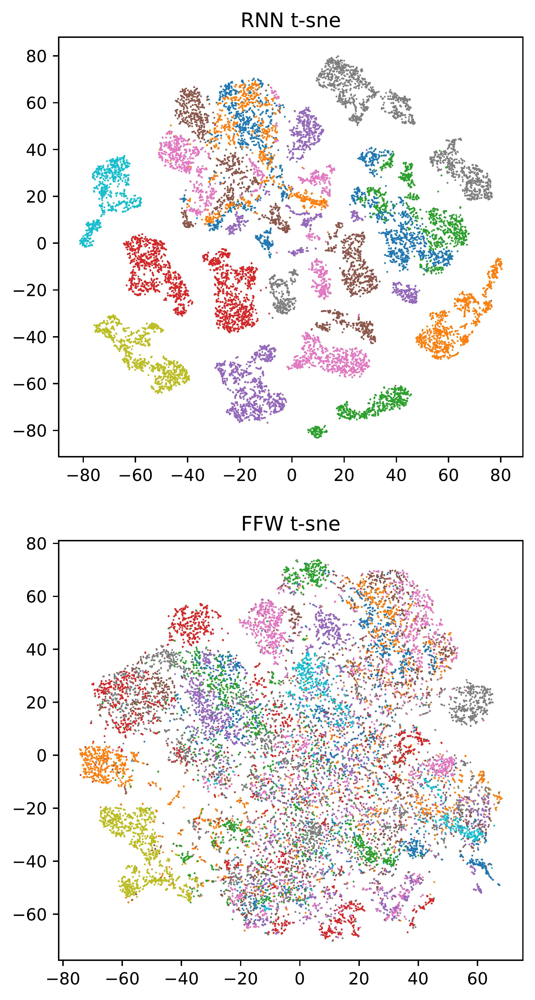

# Representation Learning with Contrastive Predictive Coding

This repo is a simple implementation of the appraoch proposed by Oord et. al. in https://arxiv.org/abs/1807.03748. 

The code here includes a minimal implementation of Contrastive Predictive Coding (CPC) for the LibriSpeech dataset (the first experiment in the Oord et. al. paper) and a model which defaults to the same architechture used in Oord et. al. 

I have included a `.yml` file here for the environment I used to create and run this repo. I make no promises that it is at all minimal... but you can use it to recreate my environment if you like.

In order to setup and run the code, first run `setup.sh` to download the data and create the nessecary folders. Then you can run `train.py` from the root directory of the repo and it should just work. The code will create a `./models/` folder and each run of `train.py` will create a new subfolder there (named by timestamp). Finally, to test your model after training, run `test.py ./models/{model_timestamp}/` in order to calculate the linear separablity of speakers in your models learned representation, and a t-SNE plot of the recurrent and feedforward embeddings colored by speaker. i.e. run:

```
$./setup.sh
$./train.py
$./test.py ./models/{model_timestamp}
```

You may have to change the defaults in `options.py` to make it work on your machine. In particular, I am running on 2 RTX 2080 TI GPUs which allows me to use a batch size of 176 and train 30 epochs in about 12 hours, which is enough to obtain performance similar to Oord et. al. In order to train on more/fewer GPUs and with a larger/smaller batch size, edit the `dev_list` and `batch_size` parameters in `options.py`. You may also want to adjust other parameters such as `num_workers` which I set to the number of processors on my machine.

If you want to change the model architechture, this is hard-coded in `CPCLibriSpeech/model_management/build_models.py`.

# Example Results

With the default parameters given here, I acheive results similar to those of Oord et. al. In particular, my linear separability scores for speakers are as follows (LogisticRegression is fit using 10\% of the test data, and tested on the remaining 90\%):

Embedding | Test Score | Train Score
------------ | ------------- | ---------------
Recurrent | 97.2% | 99.9%
Feedforward | 37.5% | 52.6%

Here is a sample t-SNE plot of a default run using this repo (and default t-SNE parameters from sklearn):


